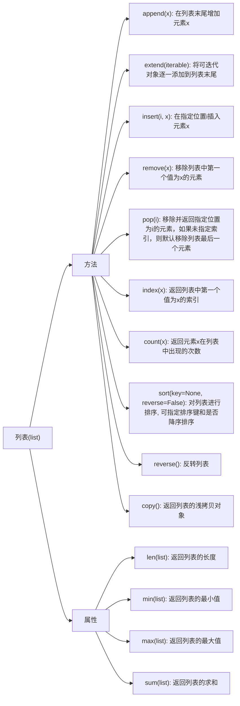

# 序列类型

除了字符串，Python还内置了多种类型的数据结构，如果要在程序中保存和操作数据，绝大多数时候可以利用现有的数据结构来实现，最常用的包括**列表**、**元组**、**集合**和**字典**

## 通用序列操作

大多数序列类型，包括可变类型和不可变类型都支持下表中的操作

此表按优先级升序列出了序列操作。 在表格中，*s* 和 *t* 是具有相同类型的序列，*n*, *i*, *j* 和 *k* 是整数而 *x* 是任何满足 *s* 所规定的类型和值限制的任意对象

|          运算          |结果|
| :---: | :---: |
|        `x in s`        |  如果 *s* 中的某项等于 *x* 则结果为 `True`，否则为 `False`   |
|      `x not in s`      |  如果 *s* 中的某项等于 *x* 则结果为 `False`，否则为 `True`   |
|        `s + t`         |                      *s* 与 *t* 相拼接                       |
|   `s * n` 或 `n * s`   |               相当于 *s* 与自身进行 *n* 次拼接               |
|         `s[i]`         |                  *s* 的第 *i* 项，起始为 0                   |
|        `s[i:j]`        |                   *s* 从 *i* 到 *j* 的切片                   |
|       `s[i:j:k]`       |             *s* 从 *i* 到 *j* 步长为 *k* 的切片              |
|        `len(s)`        |                          *s* 的长度                          |
|        `min(s)`        |                         *s* 的最小项                         |
|        `max(s)`        |                         *s* 的最大项                         |
| `s.index(x[, i[, j]])` | *x* 在 *s* 中首次出现项的索引号（索引号在 *i* 或其后且在 *j* 之前） |
|      `s.count(x)`      |                  *x* 在 *s* 中出现的总次数                   |

### 不可变序列类型

不可变序列类型普遍实现而可变序列类型未实现的唯一操作就是对 [`hash()`](https://docs.python.org/zh-cn/3/library/functions.html#hash) 内置函数的支持。

>`hash()` 是 Python 内置的一个函数，它用于将一个对象转换为一个整数值，这个整数值被称为“哈希值”。哈希值可以用于快速查找和比较，特别是在字典和集合中。对象的哈希值通常保持不变，这也是为什么**不可变对象**可以被哈希化，而**可变对象**不能
>
>尝试对包含有不可哈希的序列进行哈希运算将会导致`TypeError`

```console
>>> l = [1, 2, 3]
>>> hash(l)
Traceback (most recent call last):
  File "<stdin>", line 1, in <module>
TypeError: unhashable type: 'list'
>>>         
```

**不可变序列类型**可以被用于某些场景，例如用作`dict`的键，以及存储在`set`和`frozenset`实例中,这是因为它们可以被哈希化,而**可变序列类型**（如列表、字典等）不能直接支持哈希化操作，所以不能用于这些场景。

常见的**不可变序列类型**有:
* 字符串（`string`）：字符串是由字符组成的不可变序列。一旦创建，字符串的内容就无法更改
* 元组（`tuple`）：元组是由多个元素组成的不可变序列。一旦创建，元组的元素和长度都不可变
* 字节串（`bytes`）：字节串是一种不可变的字节序列，常用于处理二进制数据
* 不可变集合（`frozenset`）：不可变集合是一种不可变的集合类型，其中包含不可变的唯一元素

### 可变序列类型

可变序列类型在 `Python` 中指的是序列的元素可以被修改

常见的**可变序列类型**有:
* 列表（`list`）：列表是由多个元素组成的可变序列。列表可以通过添加、删除或修改元素来动态改变
* 字节数组（`bytearray`）：字节数组是一种可变的字节序列，类似于字节串（bytes），但可以修改

## 数组

数组（array）是一种线性数据结构，其将相同类型的元素存储在连续的内存空间中。我们将元素在数组中的位置称为该元素的索引（index）

### 数组常用的操作

#### 初始化数组

我们可以根据需求选用数组的两种初始化方式：无初始值、给定初始值。在未指定初始值的情况下，大多数编程语言会将数组元素初始化为 $0$

```python
array: list[int] = [0] * 5
```

#### 访问元素

数组元素被存储在连续的内存空间中，这意味着计算数组元素的内存地址非常容易，在数组中访问元素非常高效，我们可以在$O(1)$时间内随机访问数组中的任意一个元素

```python
def get(nums: list[int], index: int):
    return nums[index]
```

#### 插入元素

数组元素在内存中是紧挨着的，它们之间没有空间再存放任何数据。如果想在数组中间插入一个元素，则需要将该元素之后的所有元素都向后移动一位，之后再把元素赋值给该索引

```python
def insert(nums: list[int], num: int, index: int):
    # 把索引 index 以及之后的所有元素向后移动一位
    for i in range(len(nums) - 1, index, -1):
        nums[i] = nums[i - 1]
    # 将 num 赋给 index 处的元素
    nums[index] = num
```

#### 删除元素

若想删除索引 $i$处的元素，则需要把索引 $i$ 之后的元素都向前移动一位

```python
def remove(nums: list[int], index: int):
    # 把索引 index 之后的所有元素向前移动一位
    for i in range(index, len(nums) - 1):
        nums[i] = nums[i - 1]
```

#### 遍历数组

我们既可以通过索引遍历数组，也可以直接遍历获取数组中的每个元素

```python
for index in range(len(nums)):
    nums[index] # 通过索引遍历数组
for num in nums:
    num # 直接遍历数组
for index, num in enumerate(nums):
    # 同时遍历数组索引和元素
    pass
```

#### 查找元素

在数组中查找指定元素需要遍历数组，每轮判断元素值是否匹配，若匹配则输出对应索引，因为数组是线性数据结构，所以上述查找操作被称为<b>线性查找</b>

```python
def find(nums: list[int], target: int):
    for index, num in enumerate(nums):
        if target == num:
            return index
        return -1
```

#### 扩容数组

在复杂的系统环境中，程序难以保证数组之后的内存空间是可用的，从而无法安全地扩展数组容量。因此在大多数编程语言中，**数组的长度是不可变的**

```python
def extend(nums: list[int], enlarge: int):
    length = len(nums)
    # 初始化一个数组
    res = [] * (length + enlarge)
    for i in range(length):
        res[i] = nums[i]
    return res
```

### 数组的优点与局限性

数组存储在连续的内存空间内，且元素类型相同。这种做法包含丰富的先验信息，系统可以利用这些信息来优化数据结构的操作效率

+   **空间效率高**：数组为数据分配了连续的内存块，无须额外的结构开销
+   **支持随机访问**：数组允许在 $O(1)$时间内访问任何元素
+   **缓存局部性**：当访问数组元素时，计算机不仅会加载它，还会缓存其周围的其他数据，从而借助高速缓存来提升后续操作的执行速度

连续空间存储是一把双刃剑，其存在以下局限性

+   **插入与删除效率低**：当数组中元素较多时，插入与删除操作需要移动大量的元素
+   **长度不可变**：数组在初始化后长度就固定了，扩容数组需要将所有数据复制到新数组，开销很大
+   **空间浪费**：如果数组分配的大小超过实际所需，那么多余的空间就被浪费了

### 数组典型应用

数组是一种基础且常见的数据结构，既频繁应用在各类算法之中，也可用于实现各种复杂数据结构。

+   **随机访问**：如果我们想随机抽取一些样本，那么可以用数组存储，并生成一个随机序列，根据索引实现随机抽样。
+   **排序和搜索**：数组是排序和搜索算法最常用的数据结构。快速排序、归并排序、二分查找等都主要在数组上进行。
+   **查找表**：当需要快速查找一个元素或其对应关系时，可以使用数组作为查找表。假如我们想实现字符到 ASCII 码的映射，则可以将字符的 ASCII 码值作为索引，对应的元素存放在数组中的对应位置。
+   **机器学习**：神经网络中大量使用了向量、矩阵、张量之间的线性代数运算，这些数据都是以数组的形式构建的。数组是神经网络编程中最常使用的数据结构。
+   **数据结构实现**：数组可以用于实现栈、队列、哈希表、堆、图等数据结构。例如，图的邻接矩阵表示实际上是一个二维数组。

## 列表

列表是可变序列，通常用于存放同类项目的集合（其中精确的相似程度将根据应用而变化）

列表可以基于<u>链表</u>或<u>数组</u>实现

+   链表天然可以看作一个列表，其支持元素增删查改操作，并且可以灵活动态扩容
+   数组也支持元素增删查改，但由于其长度不可变，因此只能看作一个具有长度限制的列表

实际上，**许多编程语言中的标准库提供的列表是基于动态数组实现的**，例如 Python 中的 `list`、Java 中的 `ArrayList` 和C++ 中的 `vector` 

### 初始化列表

* 使用一对方括号来表示空列表: `[]`
* 使用方括号，其中的项以逗号分隔: `[a]`, `[a, b, c]`
* 使用列表推导式: `[x for x in iterable]`
* 使用类型的构造器: `list()` 或 `list(iterable)`

> 构造器将构造一个列表，其中的项与 *iterable* 中的项具有相同的的值与顺序。 *iterable* 可以是序列、支持迭代的容器或其它可迭代对象。 如果 *iterable* 已经是一个列表，将创建并返回其副本，类似于 `iterable[:]`
> 例如，`list('abc')` 返回 `['a', 'b', 'c']` 而 `list( (1, 2, 3) )` 返回 `[1, 2, 3]`。 如果没有给出参数，构造器将创建一个空列表 `[]`

#### list类型的构造器

`list` 类型的构造器是 `list()`，用于创建列表对象。它可以接受一个**可迭代对象**作为参数，将该对象转换为列表。如果不提供参数，则会创建一个空列表,如果传入的是一个字典，则只会获取字典的键作为列表的原色

```console
>>> s1 = "hello"
>>> list(s1)
['h', 'e', 'l', 'l', 'o']
>>> d1 = {"name": "Alice", "age": 18}
>>> list(d1)
['name', 'age']
>>> t1 = (1, 2, 3)
>>> list(t1)
[1, 2, 3]
```

**list类型的构造器与[]的区别?**

> 使用timeit模块可以测试这二者的执行时间，[] 会比 list() 快一倍左右。这是因为list()底层是C语言实现的内置函数，Python需要先查找命名空间中的 `list` 对象，然后执行函数调用，而使用[]是编译器级别的优化，没有查找或函数调用的额外开销，因此其运行效率较高。

<div style="text-align: center;"> </div>

#### 列表推导式

对于列表、元组、集合、字典的生成，`Python `有一套非常 `Pythonic` 的写法，那就是推导式，推导式的写法非常灵活

```python
[表达式 <if condition> <else 表达式2> for 变量 in 可迭代对象 <if condition> <else 表达式2> ]
```

* if-else在for循环前面,用于根据条件选择要添加的元素，或者在满足条件时决定是否包含某个元素
* if-else在for循环后面,用于筛选列表中的元素，使得只有满足条件的元素才会包含在生成的列表中

> `Pythonic `的含义
>
> **`Pythonic`** 是一个用来描述遵循 Python 语言设计哲学和最佳实践的代码或编程风格的术语。简而言之，**`Pythonic`** 代码是指符合 Python 编程语言特有的风格、简洁性和可读性原则的代码。它反映了 Python 语言的核心理念,可以通过`import this`来获取

```console
>>> import this
The Zen of Python, by Tim Peters

Beautiful is better than ugly. # 美丽胜于丑陋
Explicit is better than implicit. # 显示胜于隐示
Simple is better than complex. # 简单优于复杂
Complex is better than complicated. # # 复杂胜于繁琐
Flat is better than nested. # 扁平胜于嵌套
Sparse is better than dense. 稀疏胜于密集
Readability counts. # 可读性至关重要
Special cases aren't special enough to break the rules. # 特例不足以特殊到打破规则
Although practicality beats purity. # 虽然实用性比纯粹更优先
Errors should never pass silently. # 错误不应悄无声息地被忽略
Unless explicitly silenced. # 除非明确地被忽略
In the face of ambiguity, refuse the temptation to guess. # 面对模棱两可时，拒绝猜测的诱惑
There should be one-- and preferably only one --obvious way to do it. # 应该有且只有一种明显的解决方法
Although that way may not be obvious at first unless you're Dutch. # 虽然这种方法一开始并不明显，除非你是荷兰人（暗指 Python 的创造者 Guido van Rossum 是荷兰人）
Now is better than never. # 现在做胜于不做
Although never is often better than *right* now. # 虽然不做往往好过马上仓促做
If the implementation is hard to explain, it's a bad idea. # 如果实现很难解释，那肯定是个坏主意
If the implementation is easy to explain, it may be a good idea. # 如果实现很容易解释，那可能是个好主意
Namespaces are one honking great idea -- let's do more of those! # 命名空间是一种绝妙的理念，我们应该多加利用
```

##### 最基础的用法

列表推导式是一种快速生成列表的方式,最基础的用法如下

```console
>>> [x * x for x in range(10)]
[0, 1, 4, 9, 16, 25, 36, 49, 64, 81]
```

这个列表推导式就等价于,很明显这种写法不如列表推导式更简洁

```python
l = []
for x in range(10):
    l.append(x * x)
```

##### for循环前加上if else语句

这种情况下生成元素的数量与for循环迭代的次数一样，只是根据不同的条件使用不同的表达式而已

```console
# 如果是偶数就置为0，否则是原来的数
>>> [x if x & 1 else 0 for x in range(20)]
[0, 1, 0, 3, 0, 5, 0, 7, 0, 9, 0, 11, 0, 13, 0, 15, 0, 17, 0, 19]
```

##### for循环后加上if else 语句

这种情况下只会选取符合条件的元素，因此元素的个数与条件有关

```console
# 只选取0-20之间的奇数
>>> [x for x in range(20) if x & 1]
[1, 3, 5, 7, 9, 11, 13, 15, 17, 19]
```

##### 嵌套循环

列表推导式的执行顺序是从左到右，外层for循环的变量可以在内层中作为可迭代对象使用

```console
# 展开嵌套列表
>>> matrix = [[1, 2, 3], [4, 5, 6], [7, 8, 9, 10], [11, 12]]
>>> [x for row in matrix for x in row]
[1, 2, 3, 4, 5, 6, 7, 8, 9, 10, 11, 12]
```

### 列表常用的方法




#### append

1. `append` 方法接受一个参数，即要添**加到列表末尾**的元素。
2. `append` 方法会**修改原始列表**，而不是创建一个新的列表。
3. 如果你想一次性添加多个元素，可以考虑使用`extend`方法，它接受一个可迭代对象，并将其元素逐一添加到列表中

```console
>>> mylist = []
>>> mylist.append(1)
>>> mylist.append(2)
>>> mylist.append(3)
>>> mylist
[1, 2, 3]
```

#### extend

1. `extend` 方法接受**一个可迭代对象**作为参数，如列表、元组、字符串等。
2. `extend` 方法会修改原始列表，而不是创建一个新的列表

```console
>>> mylist = [1, 2, 3]
>>> mylist.extend([4, 5, 6])
>>> mylist
[1, 2, 3, 4, 5, 6]
```


#### insert

1. 如果指定的索引超出了列表的范围，`insert` 方法会在列表的末尾添加新元素。
2. 负数索引表示从列表末尾开始计数，例如，`my_list.insert(-1, 7)` 将在列表倒数第二个位置插入元素 7
3. `insert` 方法会修改原始列表，而不是创建一个新的列表

```console
>>> l1 = [1, 2, 3, 4, 5, 6, 8]
>>> l1.insert(0, 0)
>>> l1.insert(-1, 7)
>>> l1
[0, 1, 2, 3, 4, 5, 6, 7, 8]
```

#### remove

1. 如果列表中没有匹配的元素，`remove` 方法会引发 `ValueError`。因此，在调用 `remove` 之前，最好使用 `in` 运算符检查元素是否存在于列表中
2. 如果有多个相同的元素，只会**移除第一个匹配**的元素

```console
>>> l1 = [1, 2, 3, 4, 5, 6, 7, 8, 1, 2]
>>> l1.remove(1)
>>> l1
[2, 3, 4, 5, 6, 7, 8, 1, 2]
>>> l1.remove(9)
Traceback (most recent call last):
  File "<stdin>", line 1, in <module>
ValueError: list.remove(x): x not in list
```


#### pop

1. 如果不提供索引，`pop` 将默认移除并返回列表中的最后一个元素
2. 如果指定的索引超出了列表的范围，`pop` 方法会引发 `IndexError`


<div style="text-align: center">
    
</div>

#### index

```python
index(value, start=0, end=len(list)) 
# value 是要查找的元素的值，start 和 end 是可选参数，表示查找的范围
# 默认ch
```

1. 如果列表中没有匹配的元素，`index` 方法会引发 `ValueError`。因此，在调用 `index` 之前，最好使用 `in` 运算符检查元素是否存在于列表中
2. 可以使用 `start` 和 `end` 参数指定查找范围，其中 `start` 表示起始索引，`end` 表示结束索引（不包含在内）
3. `index` 方法只**返回第一个匹配元素的索引**。如果需要查找所有匹配元素的索引，可以使用循环结构或列表推导式

<div style="text-align: center">
    
</div>

#### count

1. 如果列表中没有匹配的元素，`count` 方法返回
2. `count` 方法只统计指定值的出现次数，不考虑值的索引

<div style="text-align: center">
    
</div>

#### sort

```python
sort(key=None, reverse=False)
```

* `key` 是可选参数，用于指定一个自定义排序函数
* `reverse` 是可选参数，如果设置为 `True`，则是降序, 默认是升序排序

<div style="text-align: center">
    
</div>

#### reverse

1. `reverse` 方法用于反转列表中的元素顺序
2. 更推荐的方法是使用切片:`[::-1]`

<div style="text-align: center">
    
</div>

#### clear

1. `clear`方法用于清空列表中所有元素

<div style="text-align: center">
    
</div>

### 列表常用的属性

#### len、min、max、sum

* `len`:返回列表中元素的个数

* `min`:返回列表中的最小值
* `max`:返回列表中的最大值
* `sum`：返回列表中所有元素的和（要求元素是可加的）

<div style="text-align: center">
    
</div>

### 合并列表

#### 使用 + 操作符

使用+操作符是合并列表最直观的操作

```console
>>> l1 = [1, 2, 3, 4]
>>> l2 = [3, 4, 5, 6]
>>> l3 = [6, 7, 8, 9]
>>> l1 + l2 + l3
[1, 2, 3, 4, 3, 4, 5, 6, 6, 7, 8, 9]
```

#### 使用 extends 方法

在列表中，使用 extend 可实现列表的自我扩展

```python
>>> l1 = [1, 2, 3]
>>> l2 = [4, 5, 6]
>>> l1.extend(l2)
>>> l1
[1, 2, 3, 4, 5, 6]
```

#### 使用列表推导式

列表推导式是一种简洁、优雅的方式来创建列表,当然也可以叫做`Pythonnic`代码

```python
>>> l1 = [1, 2, 3]
>>> l2 = [4, 5, 6]
>>> l3 = [7, 8, 9]
>>> [value for l in (l1, l2, l3) for value in l]
[1, 2, 3, 4, 5, 6, 7, 8, 9]
```

#### 借助 itertools 工具

`itertools` 是 Python 标准库中的一个模块，提供了一组用于高效循环操作的工具。这个模块包含了许多生成器函数，可以用来创建迭代器，帮助处理数据流和组合数据

```python
>>> from itertools import chain
>>> l1 = [1, 2, 3]
>>> l2 = [4, 5, 6]
>>> l3 = [7, 8, 9]
>>> list(chain(l1, l2, l3))
[1, 2, 3, 4, 5, 6, 7, 8, 9]
```

#### 使用魔法方法

我们在使用+操作符时, 实际上其内部使用了 `__add__`这个魔法方法，因此其实 + 操作符与 `__add__`方法是等价的

```python
>>> l1 = [1, 2, 3]
>>> l2 = [4, 5, 6]
>>> l3 = [7, 8, 9]
>>>
>>> l1 + l2 + l3
[1, 2, 3, 4, 5, 6, 7, 8, 9]
>>> l1.__add__(l2).__add__(l3)
[1, 2, 3, 4, 5, 6, 7, 8, 9]
```

当然了,如果要合并的列表数量很多,我们可以借助reduce这个高阶函数来处理

```python
>>> from functools import reduce
>>> l1 = [1, 2, 3]
>>> l2 = [4, 5, 6]
>>> l3 = [7, 8, 9]
>>>
>>> reduce(list.__add__, (l1, l2, l3))
[1, 2, 3, 4, 5, 6, 7, 8, 9]
```

#### 使用 * 进行解包

可能有些人对 * 的操作不太熟悉, * 可以用来解包可迭代对象,例如

```python
>>> def f(a:int, b:int, c:int) -> None:
...     print(a, b, c)
...
>>> l = [1, 2, 3]
>>> f(*l)
1 2 3
>>> k, *v, m = [1, 2, 3, 4, 5, 6, 7, 8]
>>> print(f"{k}\n{v}\n{m}")
1
[2, 3, 4, 5, 6, 7]
8
```

因此使用 * 可以解包列表，解包后可以合并列表

```python
>>> l1 = [1, 2, 3]
>>> l2 = [4, 5, 6]
>>> [*l1, *l2]
[1, 2, 3, 4, 5, 6]
```

#### 借助科学计算的第三方包

`NumPy`（Numerical Python）是一个开源的 Python 库，主要用于科学计算和数据分析。它提供了高性能的多维数组对象，以及对数组进行操作的多种工具和函数

```python
>>> import numpy as np
>>>
>>> l1 = [1, 2, 3]
>>> l2 = [4, 5, 6]
>>> l3 = [7, 8, 9]
>>>
>>> np.concatenate((l1, l2, l3)).tolist()
[1, 2, 3, 4, 5, 6, 7, 8, 9]
```

#### 使用 yield 

使用 `yield` 可以创建一个生成器函数来逐步合并多个列表，而不必一次性将所有元素加载到内存中。这种方法在处理大数据集时尤其有效

```python
>>> def merge_list(*lists):
...     for lst in lists:
...         for item in lst:
...             yield item
...
>>>
>>> l1 = [1, 2, 3]
>>> l2 = [4, 5, 6]
>>> l3 = [7, 8, 9]
>>>
>>> list(merge_list(l1, l2, l3))
[1, 2, 3, 4, 5, 6, 7, 8, 9]
```

### 基于数组实现列表

```python
class List:
    def __init__(self):
        self._capacity: int = 10  # 初始容量
        self._array: list[int] = [0] * self._capacity # 数组元素
        self._size: int = 0  # 当前元素数量
        self._extend_ratio: int = 2  # 扩容倍数

    @property
    def size(self) -> int:
        return self._size

    @property
    def capacity(self) -> int:
        return self._capacity

    def get(self, index: int) -> int:
        """根据index访问数据元素"""
        self._validate_index(index)
        return self._array[index]

    def set(self, num: int, index: int):
        """更新元素"""
        self._validate_index(index)
        self._array[index] = num

    def append(self, num: int):
        """在数组尾部追加元素"""
        if self._size == self._capacity:
            self._extend_capacity()
        self._array[self._size] = num
        self._size += 1

    def insert(self, num: int, index: int):
        """插入数据"""
        if self._validate_index(index):
            raise IndexError("索引越界")
        if self._size == self._capacity:
            self._extend_capacity()
        # 移动元素
        self._array[index + 1: self._size + 1] = self._array[index: self._size]
        self._array[index] = num
        self._size += 1

    def remove(self, index: int) -> int:
        """移除元素"""
        self._validate_index(index)
        num = self._array[index]
        # 移动元素
        self._array[index: self._size - 1] = self._array[index + 1: self._size]
        self._size -= 1
        return num

    def _extend_capacity(self):
        # 使用指数级扩容策略
        new_capacity = self._capacity * self._extend_ratio
        new_array = [0] * new_capacity
        new_array[:self._size] = self._array
        self._array = new_array
        self._capacity = new_capacity

    def _validate_index(self, index: int):
        if index < 0 or index >= self._size:
            raise IndexError("索引越界")

    def __len__(self):
        return self._size

    def __str__(self) -> str:
        return str(self._array[:self._size])

    def __repr__(self) -> str:
        return str(self._array[:self._size])
```

## 链表

链表（linked list）是一种线性数据结构，其中的每个元素都是一个节点对象，各个节点通过“引用”相连接。引用记录了下一个节点的内存地址，通过它可以从当前节点访问到下一个节点

链表的设计使得各个节点可以分散存储在内存各处，它们的内存地址无须连续。


```python
class ListNode:
    def __init__(self, node) -> None:
        self.node: int = node  # 节点的值
        self.next: ListNode | None = None  # 指向下一节点的引用
        self.previous: ListNode | None = None  # 指向上一节点的引用
```

### 初始化链表

建立链表分为两步

*   第一步是初始化各个节点对象
*   第二步是构建节点之间的引用关系。初始化完成后，我们就可以从链表的头节点出发，通过引用指向 `next` 依次访问所有节点

```python
# 初始化链表节点
n0 = ListNode(0)
n1 = ListNode(1)
n2 = ListNode(2)
n3 = ListNode(3)
# 构建节点之间的引用关系
n0.next = n1
n1.next = n2
n2.next = n3
# 引用关系为: n0 - >n1 -> n2 -> n3
```

### 插入节点

在链表中插入节点非常容易， 假设我们想在相邻的两个节点 `n0` 和 `n1` 之间插入一个新节点 `P` ，**则只需改变两个节点引用（指针）即可**，时间复杂度为$O(1)$

```python
def insert(n0:ListNode, p: ListNode):
    n1 = n0.next
    p.next = n1
    n0.next = p
```

### 删除节点

在链表中删除节点也非常方便，**只需改变一个节点的引用（指针）即可**


```python
def remove(n0: ListNode):
    """删除链表的节点 n0 之后的首个节点"""
    if not n0.next:
        return
    # n0 -> P -> n1
    P = n0.next
    n1 = P.next
    n0.next = n1
```

### 访问节点

**在链表中访问节点的效率较低**，链表则不然，程序需要从头节点出发，逐个向后遍历，直至找到目标节点。也就是说，访问链表的第$i$个节点需要循环$i-1$轮，时间复杂度为$O(n)$

```python
def get(head: ListNode, index: int) -> ListNode | None:
    for _ in range(index):
        if not head:
            return 
        head = head.next
    return head
```

### 查找节点

遍历链表，查找其中值为 `target` 的节点，输出该节点在链表中的索引

```python
def find(head: ListNode, target: int) -> int:
    """在链表中查找值为 target 的首个节点"""
    index = 0
    while head:
        if head.val == target:
            return index
        head = head.next
        index += 1
    return -1
```


### 常见的链表类型

+   **单向链表**：即前面介绍的普通链表。单向链表的节点包含值和指向下一节点的引用两项数据。我们将首个节点称为头节点，将最后一个节点称为尾节点，尾节点指向空 `None` 
+   **环形链表**：如果我们令单向链表的尾节点指向头节点（首尾相接），则得到一个环形链表。在环形链表中，任意节点都可以视作头节点
+   **双向链表**：与单向链表相比，双向链表记录了两个方向的引用。双向链表的节点定义同时包含指向后继节点（下一个节点）和前驱节点（上一个节点）的引用（指针）。相较于单向链表，双向链表更具灵活性，可以朝两个方向遍历链表，但相应地也需要占用更多的内存空间

### 链表典型应用

单向链表通常用于实现栈、队列、哈希表和图等数据结构

+   **栈与队列**：当插入和删除操作都在链表的一端进行时，它表现的特性为先进后出，对应栈；当插入操作在链表的一端进行，删除操作在链表的另一端进行，它表现的特性为先进先出，对应队列
+   **哈希表**：链式地址是解决哈希冲突的主流方案之一，在该方案中，所有冲突的元素都会被放到一个链表中
+   **图**：邻接表是表示图的一种常用方式，其中图的每个顶点都与一个链表相关联，链表中的每个元素都代表与该顶点相连的其他顶点

双向链表常用于需要快速查找前一个和后一个元素的场景

+   **高级数据结构**：比如在红黑树、B 树中，我们需要访问节点的父节点，这可以通过在节点中保存一个指向父节点的引用来实现，类似于双向链表
+   **浏览器历史**：在网页浏览器中，当用户点击前进或后退按钮时，浏览器需要知道用户访问过的前一个和后一个网页。双向链表的特性使得这种操作变得简单
+   **LRU 算法**：在缓存淘汰（LRU）算法中，我们需要快速找到最近最少使用的数据，以及支持快速添加和删除节点。这时候使用双向链表就非常合适

环形链表常用于需要周期性操作的场景，比如操作系统的资源调度

+   **时间片轮转调度算法**：在操作系统中，时间片轮转调度算法是一种常见的 CPU 调度算法，它需要对一组进程进行循环。每个进程被赋予一个时间片，当时间片用完时，CPU 将切换到下一个进程。这种循环操作可以通过环形链表来实现
+   **数据缓冲区**：在某些数据缓冲区的实现中，也可能会使用环形链表。比如在音频、视频播放器中，数据流可能会被分成多个缓冲块并放入一个环形链表，以便实现无缝播放

## 元组

元组（tuple）是一种**有序**、**不可变**的数据类型。它是由一系列用逗号分隔的值组成，通常用圆括号括起来。元组与列表（list）相似，但元组的主要区别在于元组是不可变的，一旦创建后，不能修改其内容

### 创建元组

* 使用一对圆括号来表示空元组: `()`
* 使用一个后缀的逗号来表示单元组: `a,` 或 `(a,)`
* 使用以逗号分隔的多个项: `a, b, c` or `(a, b, c)`
* 使用内置的 [`tuple()`](https://docs.python.org/zh-cn/3/library/stdtypes.html#tuple): `tuple()` 或 `tuple(iterable)`

> *iterable* 可以是序列、支持迭代的容器或其他可迭代对象。 如果 *iterable* 已经是一个元组，会不加改变地将其返回。 例如，`tuple('abc')` 返回 `('a', 'b', 'c')` 而 `tuple( [1, 2, 3] )` 返回 `(1, 2, 3)`。 如果没有给出参数，构造器将创建一个空元组 `()`

元组实现了通用序列类型的全部操作，具体可见上文[通用序列操作](#通用序列操作)

### 元组的应用场景

+   **安全性和稳定性**：不可变性保证了数据的安全性，特别是在并发环境中
+   **作为字典键**：由于元组是不可变的，可以作为字典的键使用，而列表不能
+   **函数参数**：元组在函数参数传递中特别有用，可以将多个值作为一个单元传递

## 使用range对象

* [`range`](https://docs.python.org/zh-cn/3/library/stdtypes.html#range) 类型相比常规 [`list`](https://docs.python.org/zh-cn/3/library/stdtypes.html#list) 或 [`tuple`](https://docs.python.org/zh-cn/3/library/stdtypes.html#tuple) 的优势在于一个 [`range`](https://docs.python.org/zh-cn/3/library/stdtypes.html#range) 对象总是占用固定数量的（较小）内存，不论其所表示的范围有多大（因为它只保存了 `start`, `stop` 和 `step` 值，并会根据需要计算具体单项或子范围的值）
* [`range`](https://docs.python.org/zh-cn/3/library/stdtypes.html#range) 类型表示不可变的数字序列，通常用于在 [`for`](https://docs.python.org/zh-cn/3/reference/compound_stmts.html#for) 循环中循环指定的次数

```python
range(start=0, end, step=1) # range() 函数生成的序列包含起始值，但不包含结束值。这是因为 Python 的索引和切片习惯是左闭右开的
```

* `start`：序列的起始值（可选，默认为0）
* `stop`：序列的结束值（必须指定）
* `step`：序列值之间的步长（可选，默认为1）

<div style="text-align: center">
    
</div>

## 使用集合

集合是一种无序、可变的数据类型，用于存储**不重复的元素**。Python提供了两种主要的集合类型：`set` 和 `frozenset`


<div style="text-align: center">
    
</div>

## 字典

Python中的字典（Dictionary）是一种无序的数据结构，用于存储键值对。字典是由一系列键（keys）和相应的值（values）组成的，每个键与其对应的值之间用冒号分隔，而不同键值对之间用逗号分隔。字典通常用花括号 `{}` 来表示

**python字典为什么是无序的?**

> Python字典的内部实现使用哈希表(hash table)来存储键值对，这样可以快速查找和访问元素。哈希表是一种数据结构，它使用哈希函数将键映射到存储桶（buckets）中的索引，以实现快速的查找。由于哈希函数的性质，相同的键始终映射到相同的索引，从而保证了快速的查找速度。然而，哈希表并不关心元素的顺序。因此，当你遍历字典时，键值对的顺序并不是按照它们被插入的顺序来的，而是由哈希函数的结果决定的

### 字典的创建

创建字典的基本方法是使用花括号`{}`，在其中放置以逗号分隔的键值对。例如：

```python
{"name": "smith white", "age": 22, "salary": 1000}
```

此外，也可以使用`dict()`函数来创建字典。例如：

```python
dict(name="smith white", age=22, salary=1000)
dict([("name", "smith white"), ("age", 22), ("salary", 1000)])
```

**dict和{}的区别?**

> 使用 timeit 模块，可以测试出在运行效率上，{} 会比 dict() 快三倍左右。使用 dict()，会多了个调用函数的过程，而这个过程会有进出栈的操作，相对更加耗时

<div style="text-align: center;">
    
</div>

### 访问字典中的值

#### 使用键进行访问

```python
person = {"name": "smith white", "age": 22, "salary": 1000}
person["name"]
```

如果尝试访问字典中不存在的键，将引发`KeyError`。为了避免这种错误，可以使用`get()`方法，当键不存在时，它将返回`None`或者指定的默认值

```python
person = {"name": "smith white", "age": 22, "salary": 1000}
person.get("work", None)
```

<div style="text-align: center;"> </div>

#### 使用`values`进行访问

`values` 方法返回的对象是 `dict_values` 类型的视图对象。这个视图对象提供了对字典中所有值的动态视图。你可以使用这个视图对象进行迭代、转换为列表，或者执行其他集合操作

> **注意**:两个 `dict.values()` 视图之间的相等性比较将总是返回 `False`。 这在 `dict.values()` 与其自身比较时也同样适用

```python
person.values()
for value in person.values():
    print(value)
list(person.values())
```

<div style="text-align: center;"> </div>

#### 自定义类实现点式访问

创建了一个名为 `Dict` 的类，它继承自内置的 `dict` 类。通过覆盖 `__getattr__`魔法方法，我们使得可以通过点式访问值，就像访问对象属性一样

```python
class Dict(dict):
    def __getattr__(self, attr):
        if attr in self:
            return self[attr]
        else:
            raise AttributeError(f"'Dict' object has no attribute '{attr}'")
    def __setattr__(self, attr, value):
        self[attr] = value
```

<div style="text-align: center;"> </div>

### 修改字典的值

可以直接通过键来修改字典中的值。**如果该键存在，其值将被更新；如果不存在，将添加新的键值对**。例如：

```python
  person['age'] = 21  # 修改已存在的键
  person['address'] = 'beijing'  # 添加新的键值对
```

<div style="text-align: center;"> </div>

### 字典的合并

#### 使用`update` 方法

字典对象内置了一个`update`方法,用于把另一个字典更新到自己身上

<div style="text-align: center;"> </div>

#### 使用字典解析式

Python 里对于生成列表、集合、字典，有一套非常 Pythonic 的写法。那就是列表解析式，集合解析式和字典解析式

<div style="text-align: center;"> </div>

#### 使用`|` 进行合并

Python 3.9.04a 版本中，新增了一个抓眼球的新操作符：`|`， PEP584 将它称之为合并操作符（Union Operator），用它可以很直观地合并多个字典

<div style="text-align: center">
    
</div>

#### 先解包再合并字典

使用`**`可以解包字典，解包完后再使用 dict 或者`{}`就可以合并

<div style="text-align: center">
    
</div>

## 字符串

### 字符编码

网页编码：是指网页中字符的编码方式

* **ASCII**：一个英文字母（不分大小写）占一个字节的空间
* **中文字符编码**:主要有gb2312、gbk以及gb18030
* **unicode**：容纳世界上所有语言字符和符号的集合
* **utf-8**（8-bit unicode Transformation Format）是一种针对unicode字符集的可变长度字符编码方式

Python 3中的字符串默认的编码为unicode，因此，gbk、gb2312等字符编码与utf-8编码之间都必须通过unicode编码才能互相转换。即在python中，使用`encode()`将unicode编码为utf-8、gbk等，而使用`decode()`将utf-8、gbk等字符编码解码为unicode

<div style="text-align: center;"> </div>

### 字符串格式化

#### 使用%进行字符串格式化

在Python中，采用的格式化方式和C语言是一致的，用`%`实现

| 占位符 |   替换内容   |
| :----: | :----------: |
|   %d   |     整数     |
|   %f   |    浮点数    |
|   %s   |    字符串    |
|   %x   | 十六进制整数 |

<div style="text-align: center">
    
</div>

#### 使用`format`进行字符串格式化

另一种格式化字符串的方法是使用字符串的`format()`方法，它会用传入的参数依次替换字符串内的占位符`{0}`、`{1}`

<div style="text-align: center">
    
</div>

#### 使用`f-string`进行格式化

f-string，亦称为格式化字符串常量（formatted string literals），是 `Python3.6 `新引入的一种字符串格式化方法，该方法源于[PEP 498 – Literal String Interpolation](https://python.org/dev/peps/pep-0498/)，主要目的是使格式化字符串的操作更加简便。f-string在形式上是以 `f` 或 `F` 修饰符引领的字符串（`f'xxx'` 或 `F'xxx'`），以大括号 `{}` 标明被替换的字段；f-string在本质上并不是字符串常量，而是一个在运行时运算求值的表达式

f-string在功能方面不逊于传统的[%-formatting语句](https://docs.python.org/3/library/stdtypes.html#old-string-formatting)和[`str.format()`函数](https://docs.python.org/3/library/stdtypes.html#str.format)，同时性能又优于二者，且使用起来也更加简洁明了，因此对于 `Python3.6 `及以后的版本，推荐使用f-string进行字符串格式化

<div style="text-align: center">
    
</div>

### 字符串常用的方法

#### **len()**: 返回字符串的长度

```python
my_string = "Hello, World!"
length = len(my_string)
print(length)  # 输出：13
```

#### **lower() 和 upper()**: 分别用于将字符串转换为小写和大写

```python
my_string = "Hello, World!"
lower_case = my_string.lower()
upper_case = my_string.upper()
print(lower_case)  # 输出：hello, world!
print(upper_case)  # 输出：HELLO, WORLD!
```

#### **strip()**: 用于去除字符串两端的空格或指定的字符

```python
my_string = "   Hello, World!   "
stripped_string = my_string.strip()
print(stripped_string)  # 输出：Hello, World!
```

#### **replace()**: 替换字符串中指定的子串

```python
my_string = "Hello, World!"
new_string = my_string.replace("Hello", "Hi")
print(new_string)  # 输出：Hi, World!
```

#### **split()**: 将字符串分割成列表，默认以空格为分隔符

```python
my_string = "Hello, World!"
words = my_string.split()
print(words)  # 输出：['Hello,', 'World!']
```

#### **join()**: 将列表中的元素连接成一个字符串

```python
words = ['Hello,', 'World!']
my_string = ' '.join(words)
print(my_string)  # 输出：Hello, World!
```

#### **isalpha()、isdigit()、isspace()**: 分别用于检查字符串是否只包含字母、数字或空格

```python
alpha_check = "Hello".isalpha()
digit_check = "123".isdigit()
space_check = "   ".isspace()
print(alpha_check)  # 输出：True
print(digit_check)  # 输出：True
print(space_check)  # 输出：True
```

#### **capitalize() 和 title()**: 分别用于将字符串的第一个字符大写和将每个单词的第一个字符大写

```python
my_string = "hello world"
capitalized = my_string.capitalize()
title_case = my_string.title()
print(capitalized)  # 输出：Hello world
print(title_case)   # 输出：Hello World
```

#### **swapcase()**: 将字符串中的大小写互换

```python
my_string = "Hello, World!"
swapped_case = my_string.swapcase()
print(swapped_case)  # 输出：hELLO, wORLD!
```
